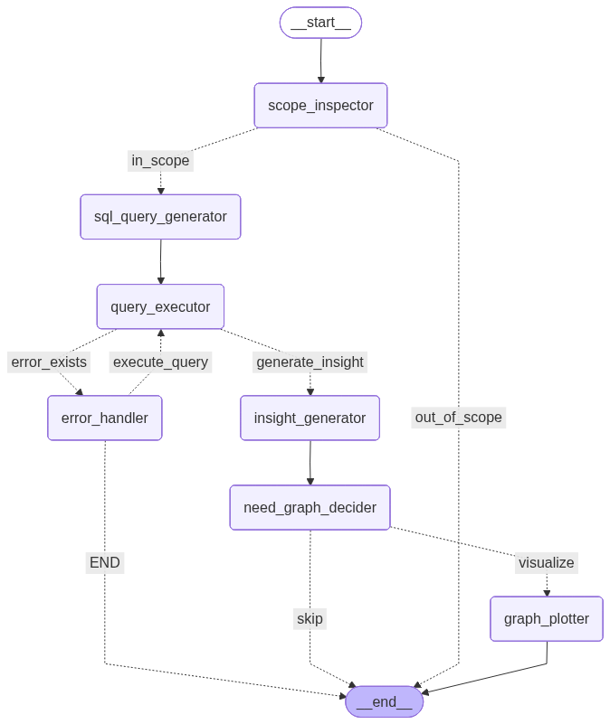
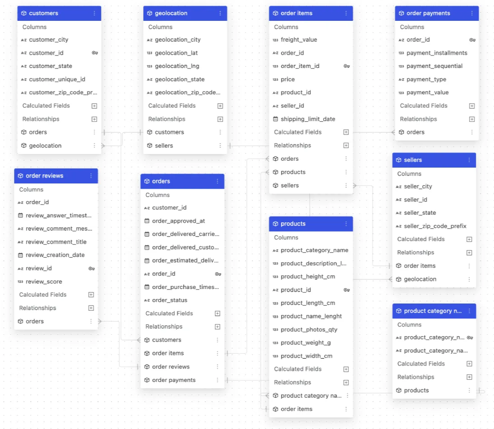

# 🛍️ NL2SQL E-Commerce Assistant

## The Problem: Data Locked Behind a Technical Wall

For decades, the ability to extract insights from an organization's databases has been gated by a single requirement — knowing SQL. Data Engineers and Analysts became the de facto gatekeepers of business intelligence, not because the data wasn't relevant to everyone, but because the language to retrieve it was inaccessible to most.

The people who needed the data most — Sales teams tracking performance, Marketing teams studying customer behavior, Operations managers monitoring fulfillment — were left waiting. They submitted requests, waited days for a response, and by the time the insight arrived, the moment had often passed. Business decisions were delayed, opportunities were missed, and a quiet frustration built between technical and non-technical teams.

This is a structural problem that no dashboard can fully solve, because dashboards only answer the questions someone thought to ask in advance.

## The Solution: Democratizing Data Access with Agentic AI

This project eliminates that dependency entirely.

**NL2SQL E-Commerce Assistant** is a multi-agent AI system that allows anyone in an organization — regardless of technical background — to query a database by simply asking a question in plain English. A Sales manager can ask *"Which product categories drove the most revenue last quarter?"* A Marketing analyst can ask *"Which states have the highest concentration of repeat customers?"* The system handles everything else: understanding the intent, generating the correct SQL, executing it safely, interpreting the results, and presenting them with intelligent visualizations when a chart would tell the story better than a table.

The system is built around a **LangGraph-orchestrated agent pipeline** that mirrors how a skilled analyst would approach a question — validating scope, writing a query, catching and correcting errors, drawing conclusions, and deciding how best to present the findings. What used to require a specialist and a ticket queue now takes seconds.

> This project demonstrates that data democratization is not just a vision — it is an engineering problem with a solution.

Built with **LangGraph**, **FastAPI**, **Streamlit**, and **OpenAI / Anthropic** models.

---

## 📸 Demo

> <video src="./graph_image_demo/ecommerce_nl2sq_demo.mp4" width="600" controls></video>


---

## ✨ Features

- **Natural Language to SQL** — Converts plain English questions into valid SQLite queries
- **Multi-Agent Pipeline** — LangGraph-orchestrated graph with dedicated nodes for scope inspection, SQL generation, error handling, insight generation, and visualization
- **Auto-Visualization** — Automatically decides when a chart would help and generates interactive Plotly charts (bar, line, pie, scatter)
- **Self-Healing Queries** — Detects SQL errors and retries with an AI-powered correction loop (up to 3 retries)
- **Guardrails** — Scope inspector filters out off-topic questions and handles greetings gracefully
- **REST API** — FastAPI backend exposes `/ask` and `/workflow-image` endpoints
- **Chat UI** — Streamlit frontend with conversation history and expandable SQL view
- **Dockerized** — Single `docker compose up` to run both services

---

## 🏗️ Architecture




The agent graph is built with **LangGraph** and can be visualized directly from the Streamlit sidebar.

---

## 🗂️ Project Structure

```
NL2SQL/
├── data/                          # CSV files from the Olist dataset
│   ├── olist_customers_dataset.csv
│   ├── olist_orders_dataset.csv
│   └── ...
├── database/
│   └── ecommerce.db               # SQLite database (auto-generated)
├── env/
│   └── .env                       # API keys (not committed — see setup)
├── notebooks/                     # Jupyter notebooks for exploration & testing
│   ├── nl2sql_agent.ipynb
│   ├── dataframe.ipynb
│   └── test_database.ipynb
├── src/
│   ├── create_sql_db.py           # Builds ecommerce.db from CSV files
│   ├── nl2sql_agent.py            # LangGraph agent (core logic)
│   ├── fastapi_app.py             # FastAPI backend
│   └── streamlit_app.py           # Streamlit frontend
├── Dockerfile.fastapi
├── Dockerfile.streamlit
├── docker-compose.yml
├── requirements.txt
└── README.md
```

---
## Data Visualization with Plotly

This project uses Plotly to create interactive and dynamic data visualizations from query results. Depending on the user's request and the selected chart type, the application generates charts such as bar charts, line charts, pie charts, and scatter plots.

Plotly provides features such as zooming, panning, tooltips, and exporting charts as images, enabling users to explore the data more effectively. The generated visualizations are rendered directly in the application to deliver an intuitive and interactive analytics experience.


## 📊 Dataset

This project uses the [Brazilian E-Commerce Public Dataset by Olist](https://www.kaggle.com/datasets/olistbr/brazilian-ecommerce) — 100k orders from 2016 to 2018 across multiple Brazilian marketplaces.

**Tables included:**

| Table | Description |
|---|---|
| `customers` | Customer IDs, city, state, ZIP |
| `orders` | Order status, timestamps, delivery dates |
| `order_items` | Products per order, price, freight |
| `order_payments` | Payment method, installments, value |
| `order_reviews` | Review scores and comments |
| `products` | Category, dimensions, weight |
| `sellers` | Seller location info |
| `geolocation` | ZIP code coordinates |
| `product_category_name_translation` | Portuguese → English category names |

> **Download the dataset from Kaggle and place the CSV files in the `data/` folder before running setup.**




---


## 🚀 Getting Started

### Prerequisites

- Python 3.11+
- Docker & Docker Compose (for containerized deployment)
- Kaggle account to download the dataset

### 1. Clone the Repository

```bash
git clone https://github.com/AliAtwi77/multi-agent-ecommerce-nl2sql.git
cd multi-agent-ecommerce-nl2sql
```

### 2. Download the Dataset

Download the Olist dataset from [Kaggle](https://www.kaggle.com/datasets/olistbr/brazilian-ecommerce) and place all CSV files inside the `data/` folder.

### 3. Set Up Environment Variables

Create the file `env/.env` with your API keys:

```env
OPENAI_API_KEY=your_openai_api_key_here
ANTHROPIC_API_KEY=your_anthropic_api_key_here
```

> ⚠️ **Never commit this file.** It is already listed in `.gitignore`.

**Required API keys:**

| Key | Used For |
|---|---|
| `OPENAI_API_KEY` | SQL generation, scope inspection, graph type decision (GPT models) |
| `ANTHROPIC_API_KEY` | Insight generation, SQL error correction (Claude models) |

### 4. Build the SQLite Database

```bash
pip install -r requirements.txt
python src/create_sql_db.py
```

This reads all CSVs from `data/` and creates `database/ecommerce.db`.

---

## 🐳 Running with Docker (Recommended)

```bash
docker compose up --build
```

| Service | URL |
|---|---|
| Streamlit UI | http://localhost:8501 |
| FastAPI backend | http://localhost:8000 |
| API docs (Swagger) | http://localhost:8000/docs |

The `docker-compose.yml` mounts `./database` into both containers so the pre-built database is shared without being baked into the image.

---

## 💻 Running Locally (Without Docker)

**Terminal 1 — Start the API:**
```bash
uvicorn src.fastapi_app:app --reload --port 8000
```

**Terminal 2 — Start the UI:**
```bash
streamlit run src/streamlit_app.py
```

---

## 🔌 API Reference

### `POST /ask`

Submit a natural language question.

**Request:**
```json
{
  "question": "Top 5 product categories by revenue?"
}
```

**Response:**
```json
{
  "final_answer": "The top 5 product categories by revenue are...",
  "query_generated": "SELECT ... FROM ...",
  "graph_json": "{...}"
}
```

### `GET /workflow-image`

Returns a PNG diagram of the LangGraph agent workflow.

### `GET /health`

Returns `{"status": "ok"}` — useful for container health checks.

---

## 💬 Example Questions

- How many orders were delivered?
- What are the top 5 product categories by total sales?
- Which sellers have the highest average review score?
- Which customers placed orders in more than 3 different product categories?
- Find the top 10 customers by total spending
- What is the correlation between review score and delivery delay in days?

---

## 🧰 Tech Stack

| Layer | Technology |
|---|---|
| Agent Orchestration | [LangGraph](https://github.com/langchain-ai/langgraph) |
| LLM Integration | [LangChain](https://github.com/langchain-ai/langchain) |
| Language Models | OpenAI GPT (query gen, routing) · Anthropic Claude (insights, error fixing) |
| Database | SQLite via Python `sqlite3` |
| Data Processing | Pandas |
| Visualization | Plotly |
| Backend API | FastAPI |
| Frontend | Streamlit |
| Containerization | Docker · Docker Compose |

---

## ⚙️ Configuration

Key settings live in `src/nl2sql_agent.py`:

| Setting | Default | Description |
|---|---|---|
| SQL generation model | `gpt-5.2` | OpenAI model for query generation |
| Routing/scope model | `gpt-5-mini` | Lightweight model for classification |
| Insight/error model | `claude-sonnet-4-5` | Claude model for interpretation |
| Max error retries | `3` | How many times to retry a failing SQL query |
| Result row limit | `100` | Max rows fetched per query |
| Chart row limit | `20` | Max data points rendered in charts |

---


## 📄 License

This project is licensed under the MIT License. See `LICENSE` for details.

---

